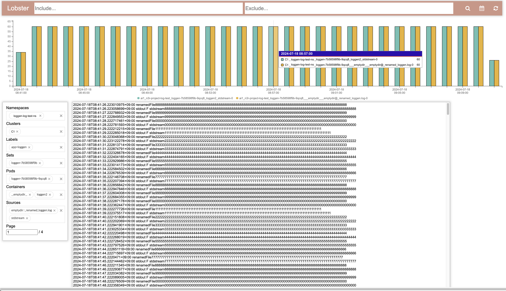
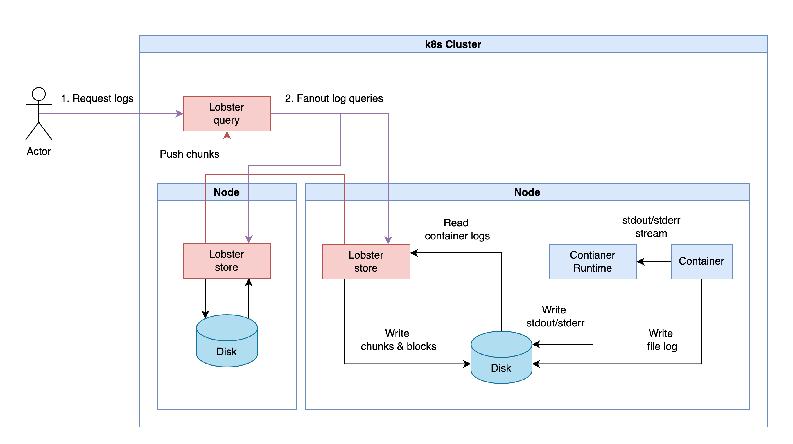
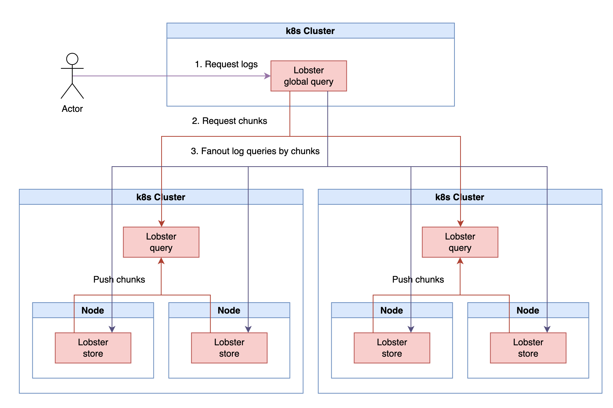
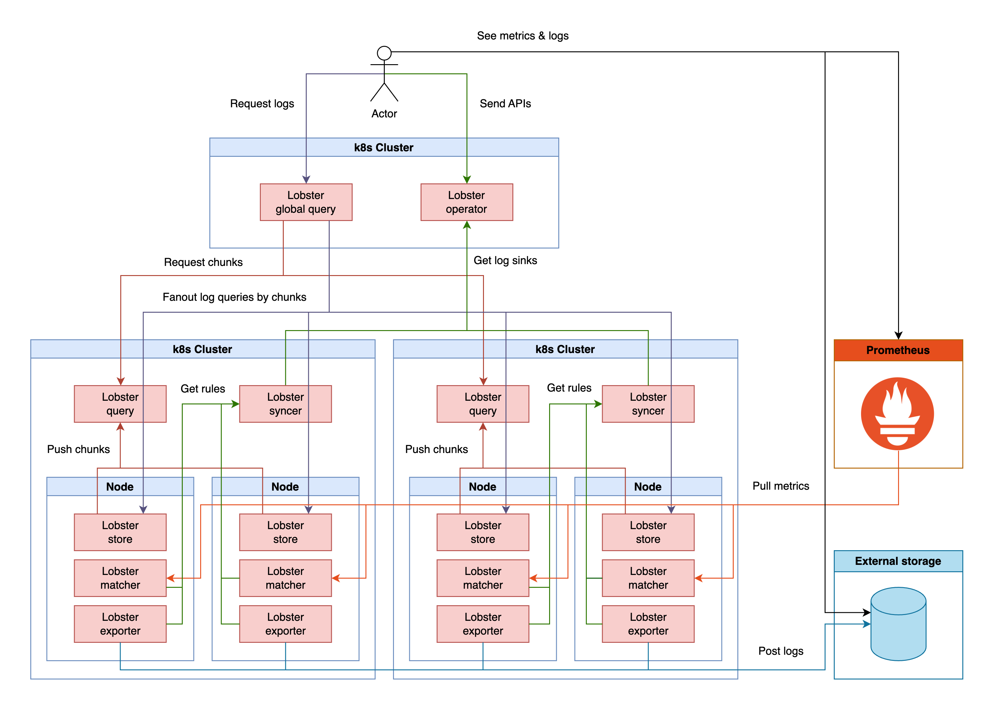

## Introduction

Lobster is a distributed Kubernetes container logging system that can be installed in a Kubernetes cluster to store and query logs from Kubernetes containers.

At Kubernetes, we need to consider [cluster-level logging architectures](https://kubernetes.io/docs/concepts/cluster-administration/logging/#cluster-level-logging-architectures).\
The main thing is the need for storage with different life cycles.
- Need to look up the container logs that the Pod had before it was relocated
- Need to look up the rotated logs
- Need to look up by any groups or time ranges

The main concepts of Lobster are:
- Supports logs for all containers in Kubernetes that are rotated and relocated
- Supports the ability to view multiple logs from a single endpoint based on time and Kubernetes objects
- Supports easy installation using the node disk without having to build separate storage for the log system in the Kubernetes environment

For more information, please refer to the documents below.

### Getting Started

> I'm preparing public images to make it easier to use lobster.

- [Build](./docs/build.md)
- [Deployment](./docs/deployment.md)
- [Design](./docs/design/README.md)
- [APIs](./docs/apis/README.md)

### Features

- `Lobster store` tails and collects the log files with the container's `stdout/stderr` in container log directories
- If the container is mounting an [emptydir volumes](https://kubernetes.io/docs/concepts/storage/volumes/#emptydir), `Lobster store` tails and collects the log files in emptydir volume directories. There are some requirements to tail files as below
  - Log line should start with `{RFC 3339 timestamp}`
  - Log file should have `.log` extension
- Search logs from multiple distributed clusters in one view
- Search logs with units of Kubernetes objects(e.g. Namespace, Label, Set, Pod, and Container)
- Supports log search options to include/exclude logs based on [google re2](https://github.com/google/re2/wiki/Syntax)
- Supports logs sink custom resources
  - `Log metric`: Create a metric by defining a pattern of log lines within a log sink(e.g. count `GET` logs)
  - `Log export`: Export logs by defining a pattern of log lines within a log sink(e.g. send `GET` logs to an external bucket)
- To prevent overload on nodes caused by excessive container logs, there are configurable limits on the number of logs per container
  - 1MB/s ~ 30MB/s
  - 30k lines/s
- To manage the capabilities of node disks, there are configurable limits on log storage retention
  - 1 week, 2 GB retention
- Supports web page view from query component



### Architecture Overview

#### Single-cluster version

- `Lobster store` stores logs produced from containers and provides APIs to query them
- `Lobster query` can perform log queries on multiple `Lobster stores`. The query can be done on APIs or the Lobster web page. The query is fanned out to each `Lobster store` and `Lobster query` responds by aggregating the query results

See more in [Lobster store](./docs/design/lobster_query.md) and [Lobster query](./docs/design/lobster_query.md) documents.



#### Multi-clusters version

- `Lobster global query` requests to the `Lobster query` of each cluster to obtain the chunks containing an address of `Lobster store`
- `Lobster global query` queries each `Lobster store` directly based on the chunks and it responds by aggregating the query results

See more in [Lobster query](./docs/design/lobster_query.md) document.



#### Multi-clusters with log sink version

It goes a bit further from `Multi-clusters model` and supports `Log sink`

- `Log sink` is the action of exporting logs to external storage or creating metrics
- `Lobster operator` defines `Log sink custom resources` and manages settings for log export/metric
- `Lobster matcher` produces metrics for matching logs based on `Log sink (log metric)` rules. This metrics follow the [prometheus data model](https://prometheus.io/docs/concepts/data_model/)
- `Lobster exporter` posts matching logs to external storage based on `Log sink (log export)` rules

See more in [Log sink](./docs/design/log_sink.md) document.



### License

```
Lobster
Copyright (c) 2024-present NAVER Corp.

Licensed under the Apache License, Version 2.0 (the "License");
you may not use this file except in compliance with the License.
You may obtain a copy of the License at

    http://www.apache.org/licenses/LICENSE-2.0

Unless required by applicable law or agreed to in writing, software
distributed under the License is distributed on an "AS IS" BASIS,
WITHOUT WARRANTIES OR CONDITIONS OF ANY KIND, either express or implied.
See the License for the specific language governing permissions and
limitations under the License.
```
