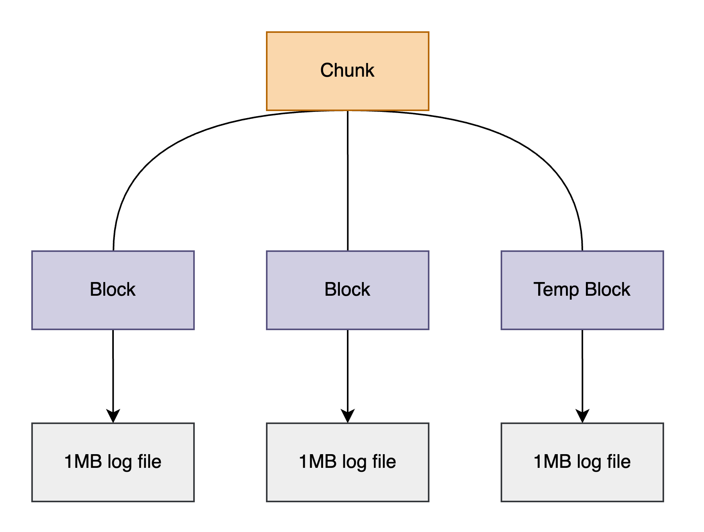

## Chunks & Blocks

`Lobster` stores [Kubernetes container logs](./container_logs.md) in chunks and blocks on each Kubernetes node disk and serves the log queries by chunks.\
When the process boots up, it configures chunks and blocks based on files saved to disk and updates them while tracking the latest log.

### Chunks

`Chunk` is a metadata object containing information about container logs.\
The information Chunk has is as follows:
- It has the names of Container, Pod, Replicaset/Statefulset, Namespace, Cluster and includes Pod labels.\
  These names and labels are used in log query parameters
- It directly contains information on blocks corresponding to chunks(metadata), which is intended to refer to the actual log stored on the disk. Each block has information about each log

### Blocks
`Block` refers to a log file of 1MB in size stored by `Lobster`.\
The role of `Block` for saving and retrieving is divided as follows:
- `Save`: `Lobster` tracks the latest logs and collects them in `Temp block`. `Temp block` is managed as a file, and when its size reaches 1MB or more, `Lobster` changes the file in `{log start time}_{log end time}_{# of log line}_{file number}.log` format. And new logs are stacked again in the `Temp block`
- `Retrieve`: `Lobster` loads and updates information about each `Block`. Past logs are found through the log file (.log) pointed to by `Block`, and the latest logs are found in `Temp block`