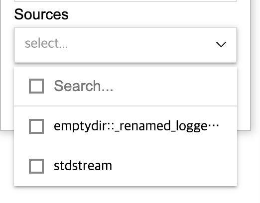

## Log types

`Lobster` supports `k8s stdout/stderr` and `File log(emptydir)` collection.

- `k8s stdout/stderr`: Logs from processes associated with stdout and stderr are automatically collected without any additional settings
- `File log(emptydir)`: Logs are collected from [Kubernetes emptyDir](https://kubernetes.io/docs/concepts/storage/volumes/#emptydir) volumes when specific conditions are met

In Lobster web page, you can view this information under the `Sources` field

### Kubernetes logs, stdout/stderr

- In the Kubernetes environment, the container's stdout/stderr logs are recorded on Node’s disk
- The stdout/stderr logs are automatically collected by the logging system installed on Node
- The log line format is as follows:
  - `{RFC 3339Nano timestamp} {stdout/stderr} {Partial/Full} {log}`
  - https://github.com/kubernetes/design-proposals-archive/blob/main/node/kubelet-cri-logging.md

### File log (emptyDir)

- If you mount an [emptyDir volume](https://kubernetes.io/docs/concepts/storage/volumes/#emptydir) in a container, you can store a log file on the Node's disk
  The files that meet the following requirements for collection are automatically tracked and collected
- Multiple log files created in a single container can be collected and retrieved
- The log line format is as follows:
  - `{RFC 3339 Nano timestamp} {log}`
- Requirements for collection
  - `timestamp`
    - The log line must start with `{RFC 3339 Nano timestamp}`
    - Logs are collected and retrieved based on the timestamp located in the log line head, even if there is a separate timestamp in the `log`
  - `.log` file extension
    - If logs are stored in a Kubernetes emptyDir, the logging system tracks logs recorded in the Node's disk
    - Only files with the `.log` extension on the Node disk can be tracked
