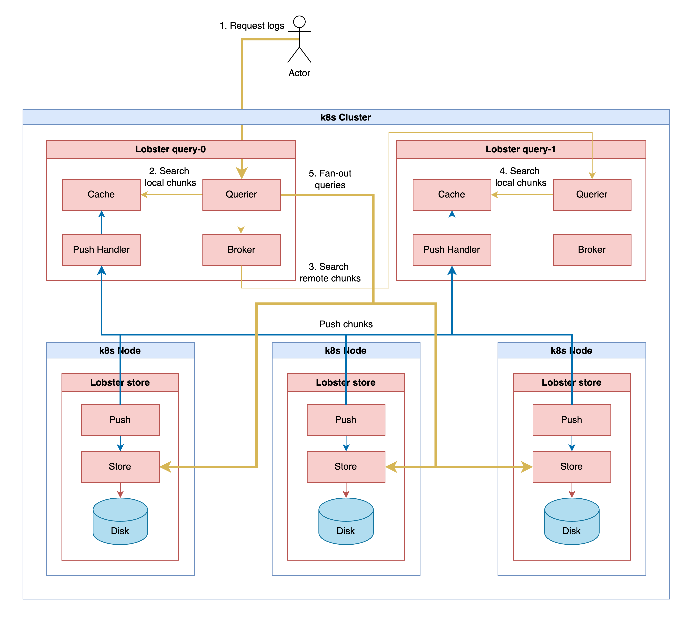

## Lobster query

`Lobster query` is a component that receives a log query, sends the query to [`Lobster store`](./lobster_store.md) that exists in each node, and aggregates the results.\
This document also describes `Lobster global query`, which can send a log query to clusters composed of {`Lobster query` + `Lobster store`} and aggregate the results, and own a `Web page`.

### Architecture(Lobster query)

`Lobster query` is architectured around Cache.\
`Lobster store` existing on each k8s node pushes a [Chunk](./chunk_block.md) containing the address of `Lobster store` to `Lobster query`, and `Lobster query` caches it.\
Then, when performing a log request, `Lobster query` identifies the address of `Lobster store` where the log exists through the cache and makes a direct log request.
For APIs, please refer to the [API documentation](../apis/query_apis.md).

- First, `Push` module of `Lobster store` looks up [Kubernetes headless service](https://kubernetes.io/docs/concepts/services-networking/service/#headless-services) to which `Lobster query` is bound to obtain the addresses of each `Lobster query`
- `Lobster store` sends its `Chunk` to `Lobster query` based on the address obtained. In other words, the store informs what logs it has
- The more `Lobster stores` there are, the more the `Cache` of `Lobster query` will burden memory and performance. To distribute this, `Push handler` divides the burden by distinguishing `Chunk` to be accepted using a Hashing-based [Modular Operation](https://en.wikipedia.org/wiki/Modular_arithmetic)
- `Chunk` is distributed and stored in multiple `Lobster query`, and when a request comes to `Querier`, it finds an appropriate log target through the following procedure. 
  - Find the `Chunk` matching log request parameter in the local cache
  - Query other `Lobster query` to find another `Chunk`
  - Synthesize these chunks to get information about where each log is in the entire k8s cluster
- Fan-out queries to each `Lobster store` based on the address information. Collect these results, sort them in chronological order, and respond to the user

### Architecture(Lobster global query)

The design of `Lobster global query` is simple and the operation principle is similar to `Lobster query`.\
When there is a log request, `Lobster global query` requests `Chunk` from `Lobster query` distributed in each cluster and requests the log directly to the `Lobster store` address contained in the `Chunk`. \
The part that collects the results and responds is the same as `Lobster query`.
For APIs, please refer to the [API documentation](../apis/global_query_apis.md).

### Web page

Both `Lobster query` and `Lobster global query` provide web pages. \
This allows multiple selections of targets and displays the log volume in a graph. 
- Include/exclude at the top takes an expression based on [google re2](https://github.com/google/re2/wiki/Syntax) as input. You can search by including or excluding logs that match the expression
- You can adjust the time range and use the refresh button to reset to the last 30 minutes
- The histogram expresses the log volume in containers, and there is a file number in the legend field at the end. The file number is an instance number that can increase every time the container restarts
- You can select Namespaces, Clusters, Labels, Pods, Containers, and [Sources](./container_logs.md) through the left panel
- The logs are paged and organized by time

