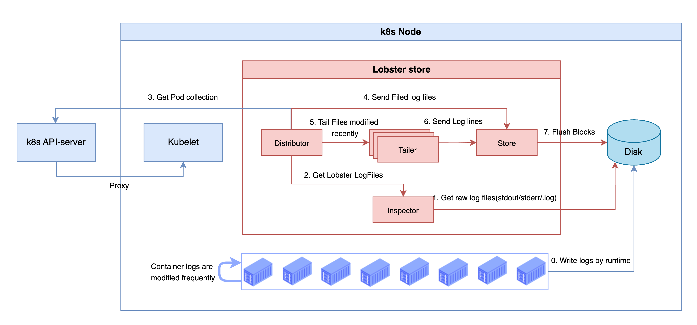

## Lobster store

`Lobster store` is a component that acts as a logging agent for [Kubernetes container logs](./container_logs.md) to store logs locally on the node, and as an API server, it provides APIs to retrieve logs. \
This document describes how `Lobster store` tracks and stores logs.

### Architecture

Container logs are written to disk as files by the container runtime, and `Lobster store` tracks these files.
- `Inspector` of `Lobster store` objectifies the necessary information from container log files
- `Distributor` requests the pod labels information to Kubelet (via k8s API-server) through the objectified information
- `Distributor` synthesizes the information and classifies the old logs to be stored in the `Store` and the log files modified recently to be tailed by the `Tailer`
- `Tailer` tails log lines of the log files in real-time and passes them to the `Store` 
- `Store` buffers and flushes logs to the disk according to the configurable time (default 1s).
- The log information is managed in the cache in the `Store` and used for log queries.



### What is stored?

- Based on Kubernetes metadata and log file information, directories are organized and files are written.
- The following describes the file system for Pods and Containers.

#### Inside of Pod directory

- `labels` file: This is a file that records the label of the pod corresponding to the directory information. This file is referenced during bootup to initialize the store cache, and the cache can be used to find logs based on the pod labels.
- `{container name}` directory: The path where container `stdout/stderr` is stored.
- `emptydir@{file path}` directory: The path where container `file logs` are stored.

```
$ ls /data/log/{namespace}_{pod name}_{pod uid}/

emptydir@_renamed_loggen.log   -> emptydir@{file path} dir
labels                         -> labels file
loggen1                        -> {container name} dir
log-rotate                     -> {container name} dir
```

#### Inside of Container & file path directory

- `block` file: This is the file where old logs of about 1MB are stored. See [Blocks](./chunk_block.md/#blocks)
- `temp block` file: This is the file where the latest logs of about 1MB are stored. See [Blocks](./chunk_block.md/#blocks)
- `checkpoint` file: This contains the file number and offsets information being tailed.

```
$ ls /data/log/{namespace}_{pod name}_{pod uid}/{container name}/

2024-07-17T10:58:51.27564213+09:00_2024-07-17T10:58:51.27564213+09:00_1_0.log  -> block file
checkpoint                                                                     -> checkpoint file
temp.log                                                                       -> temp block file
```