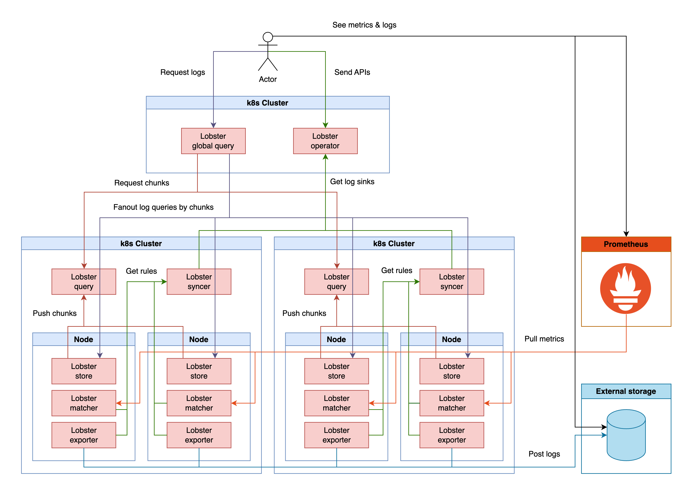

## Log sink

Log sink is a configuration that exports logs to the outside or creates metrics. \
`Lobster` defines this configuration as a [kubernetes custom resource](https://kubernetes.io/docs/concepts/extend-kubernetes/api-extension/custom-resources/) and can be managed by user namespaces in multiple clusters. \
You can create a `LobsterSink` directly in kubernetes via `kubectl` with yaml files or via the API-server of the `Lobster operator`. \
For APIs, please refer to the [API documentation](../apis/operator_apis.md).

### LobsterSink

`LobsterSink` defines types for log metrics/exports.\
You can see how to use LobsterSink by type through the examples below.

#### Example(type: `logMetricRules`)

Below is an example of creating a `LobsterSink` called `metric` in the `log-test` namespace.
- The rule named `include-error-for-tc-container` counts logs containing `error` from logs produced by `tc-container` in the pods labeled `app=sampleA` in the `log-test` namespace
- The rule named `exclude-GET` counts logs produced by all containers in the pods labeled `app=sampleB` in the `log-test` namespace in `clusterA and clusterB`, excluding `GET`

```yaml
apiVersion: lobster.io/v1
kind: LobsterSink
metadata:
  name: metric
  namespace: log-test
spec:
  type: logMetricRules
  logMetricRules:
  - name: include-error-for-tc-container
    filter:
      include: "error”
      labels:
      - app: sampleA
      namespace: log-test
      container: tc-container
  - name: exclude-GET
    filter:
      clusters:
      - clusterA
      - clusterB
      exclude: "GET”
      labels:
      - app: sampleB
      namespace: log-test
```

#### Example(type: `logMetricRules`)

Below is an example of creating a `LobsterSink` called `export` in the `log-test` namespace.
- The rule named `include-error-for-tc-container` sends logs containing `error` from the logs produced by `tc-container` among the pods labeled `app=sampleA` in the `log-test` namespace to `{bucket destination}` every minute. If the bucket supports path configuration, the root path can be `/`.
- The rule named `exclude-GET` sends logs except `GET` from the logs produced by all containers of the pods labeled `app=sampleB` in the `log-test` namespace of `clusterA and clusterB` to `{bucket destination}` every hour. If the bucket supports path configuration, the root path can be `/`.
- `logMetricRules` supports `basicBucket`(multi-part upload) and `s3Bucket`

```yaml
apiVersion: lobster.io/v1
kind: LobsterSink
metadata:
  name: export
  namespace: log-test
spec:
  name: match-labels-exclude
  type: logMetricRules
  logMetricRules:
  - name: include-error-for-tc-container
    interval: 1m
    filter:
      include: "error”
      labels:
      - app: sampleA
      namespace: log-test
      container: tc-container
    basicBucket:
      destination: http://{basicBucket endpoint}
      rootPath: / # deprecated
      timeLayoutOfSubDirectory: {time layout of sub-directory; default `2006-01`}
      pathTemplate: "/path/{{TimeLayout \"20060102\"}}"
  - name: exclude-GET
    interval: 1h
    filter:
      clusters:
      - clusterA
      - clusterB
      exclude: "GET”
      labels:
      - app: sampleB
      namespace: log-test
    s3Bucket:
      destination: http://{s3 bucket endpoint}
      rootPath: / # deprecated
      timeLayoutOfSubDirectory: {time layout of sub-directory; default `2006-01`}
      pathTemplate: "/path/{{TimeLayout \"20060102\"}}"
      bucketName: {s3 bucket name}
      accessKey: {s3 bucket access key}
      secretKey: {s3 bucket secret key}
      Tags: # supports multiple tags
        {label1}: {value1}
        {label2}: {value2}
        ...
```

### Architecture

`LobsterSink` rule generated through `Lobster operator` is synchronized to each cluster to perform log metrics/export.
- `Lobster operator` manages a custom resource called `LobsterSink` and has a built-in API server
- `Lobster syncer` gets rules from `Lobster operator`, and each `matcher` and `exporter` request a part of these rules based on the namespace where the latest log occurs
  - If you want to use these features in a single cluster, you can install and link `Lobster operator` and `Lobster syncer` in the same cluster
- `matcher` compares the currently tailed logs with the metric rule and produces a Prometheus metric. Please refer to the [metrics](./metrics.md) guide for the metric contents. 
- `matcher` operates as a module within `store` and `exporter` operates as a sidecar for `store`
- `exporter` periodically sends logs as a file to external storage. Since information about transfer volume or transfer failure is produced as Prometheus metrics, please refer to the [metrics](./metrics.md) guide for the metric contents
  - If a bucket has a directory structure, the directory can follow the rules below\
    - AS-IS(deprecated): `{Root path}/{time layout of sub-directory}/{Namespace}/{LobsterSink name}/{Contents name}/{Pod}/{Container}/{Start time of log}_{End time of log}.log`
    - TO-BE
      - default: `/{time layout(2006-01)}/{Namespace}/{LobsterSink name}/{Contents name}/{Pod}/{Container}/{Start time of log}_{End time of log}.log`
      - Using PathTemplate: `/{PathTemplate}/{Start time of log}_{End time of log}.log` (Please refer to the `PathTemplate` section below for more details.)
- `time layout of sub-directory` is an option(default `2006-01`) that sets the name of the sub-directory following `{Root path}` to a time-based layout \
   Logs can be stored in a specific directory according to the rendering results of the layout, such as time or date
   - Here are some examples
     ```
      now: 2009-11-10T23:00:00Z
 
     // You can separate the directories into small time chunks, or group them by day or month, as shown below

     // If you have a layout that represents time in seconds, 
     // lobster will create directories in your bucket with names in seconds 
     layout: 20060102150405 | result: 20091110230000
     layout: 15:04:05 01-02-2006 | result: 23:00:00 11-10-2009
     layout: 2006-01-02-15:04:05 | result: 2009-11-10-23:00:00
     layout: 2006-01-02 15:04:05 | result: 2009-11-10 23:00:00
     layout: 2006-01-02_15:04:05 | result: 2009-11-10_23:00:00

     // If you have a layout that represents time in days, 
     // lobster will create directories in your bucket with names in days 
     layout: 2006010215 | result: 2009111023
     layout: 15 01-02-2006 | result: 23 11-10-2009
     layout: 2006-01-02-15 | result: 2009-11-10-23
     layout: 2006-01-02 15 | result: 2009-11-10 23
     layout: 2006-01-02_15 | result: 2009-11-10_23
     ```
   - Please refer to the below documents for more information about the time layout 
     - https://pkg.go.dev/time#example-Time.Format
     - https://go.dev/src/time/format.go




### PathTemplate

- As the exported logs are transformed into various formats, the requirements for log paths have also increased
- With the `PathTemplate` based on Go templates, you can freely structure fields using the template fields described below

#### Template Fields
- Reserved keywords are provided to allow flexible directory composition in the path
- Each field can be used multiple times
- If this feature is not used, the default path structure is applied
  - `/{time layout(2006-01)}/{Namespace}/{LobsterSink name}/{Contents name}/{Pod}/{Container}/{Start time of log}_{End time of log}.log`

Field | Description
--- | ---
`{{TimeLayout "2006-01-02"}}` | Time based directory layout 
`{{.Namespace}}` | Log source namespace name
`{{.SinkName}}` | Lobster sink name
`{{.RuleName}}` | Rule name in Lobster sink
`{{.Pod}}` | Pod name
`{{.Container}}` | Container name or `__emptydir__`
`{{.SourceType}}` | `stdstream` or `emptydir`
`{{.SourcePath}}` | A file path within an emptyDir volume

#### Example

```
spec:
  logExportRules:
  - basicBucket:
      pathTemplate: /pathtest/{{TimeLayout "20060102"}}/{{.Container}}
  ...
```

PathTemplate | Exported file
--- | ---
`/lobster` | /lobster/2025-01-06T14:17:15%2B09:00_2025-01-06T14:17:17%2B09:00.log 
`/{{TimeLayout "2006-01"}}` | /2025-01/2025-01-06T14:17:15%2B09:00_2025-01-06T14:17:17%2B09:00.log 
`/{{.Pod}}` | /loggen-123/2025-01-06T14:17:15%2B09:00_2025-01-06T14:17:17%2B09:00.log 
`/{{.SourcePath}}/{{.Pod}}` | /renamed_namespaceA_test.log/loggen-123/2025-01-06T14:17:15%2B09:00_2025-01-06T14:17:17%2B09:00.log 
`/lobster/{{TimeLayout "2006-01"}}/123/{{.SourcePath}}` | /lobster/2025-01/123/renamed_namespaceA_test.log/2025-01-06T14:17:15%2B09:00_2025-01-06T14:17:17%2B09:00.log 
`/{{TimeLayout "2006-01"}}/{{TimeLayout "2006-01-02"}}` | /2025-01/2025-01-06/2025-01-06T14:17:15%2B09:00_2025-01-06T14:17:17%2B09:00.log 

#### Cautions

- Customization introduces potential risks of conflicts due to insufficient delimiters
- For example, with configurations like `/{{.Pod}}`, where delimiters are insufficient, \
  conflicts may arise when exporting logs from multiple containers, each having the same log timestamp
  - container A - `2025-01-06T18:20:24%252B09:00_2025-01-06T18:21:23%252B09:00.log`
  - container B - `2025-01-06T18:20:24%252B09:00_2025-01-06T18:21:23%252B09:00.log`


