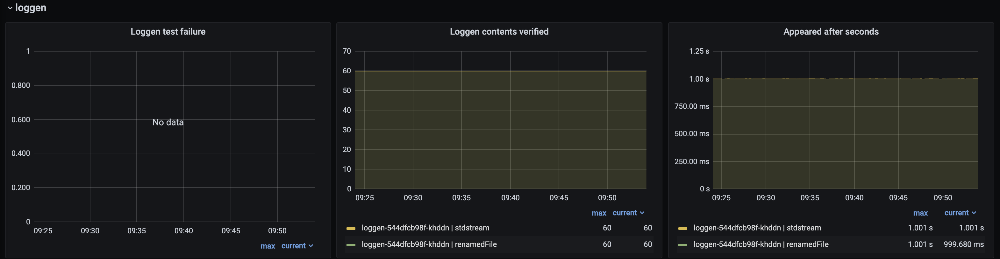
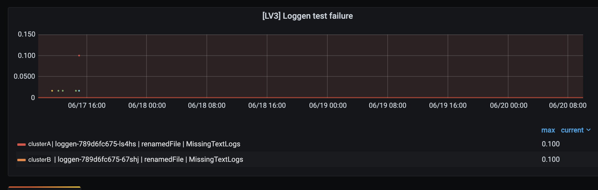

## Loggen

`Loggen` is a real-time testing component that repeatedly generates numbers from 0 to 9 and queries `Lobster` to verify them.
This checks the following and provides the results as [metrics](./metrics.md).

- `Real-time logs`: Check if the difference between the query result and the current time is less than 1 second
- `Time order of the logs`: Check if there are any timestamps that are out of order
- `Logs consistency`: Check if there are any logs missing from the repetition of `0 ~ 9`

### Usage example(grafana dashboard)

Log system operators can use the [metrics](./metrics.md) generated by `Loggen` to determine the status of the log system and whether there are any issues.\
Below is an example of metrics in Grafana.

#### Normal

#### When there is a problem
